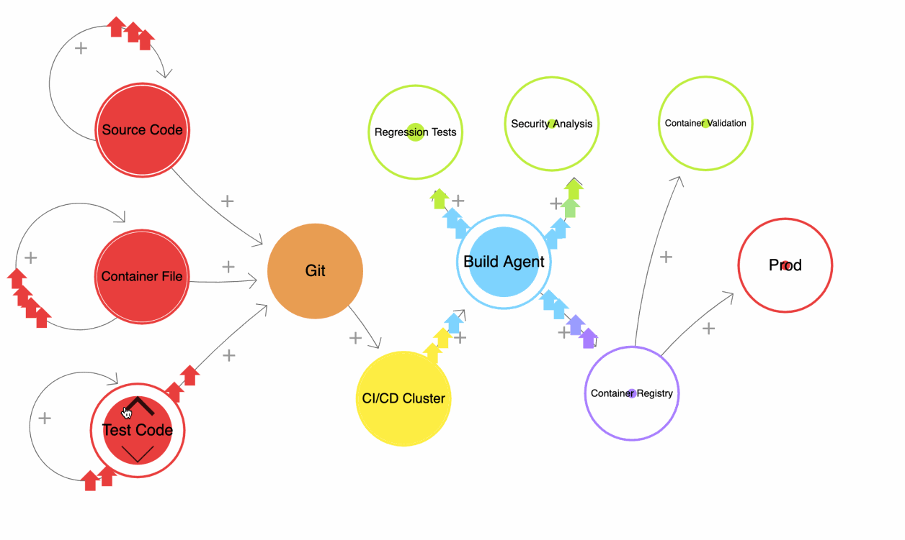

# SRE-Lab

Let’s image that a new application is being developed and you are part of the SRE team where your task to take care of the continuous integration and continuous deployment pipeline as well as make the application ready for responding to a high demand.

## Design

## Pipeline

Ideally, if several teams work in similar tech staks, you can consider using heavy customizable tempaltes for pipelines, or creating Jenkins libraries and plugins, based on the DSL as example. 

## Observability
Infra

## Availability

How to configure K8s + CDN (Akamai), load balancers 

helm

kustomize

ejemplo kubernetes config 

configmap by environment
ingress deployment service & HPA

Personal experience with Openshift, solving proxy and traffic limitations of K8s 

## Trade offs 

A lot of hands needed

